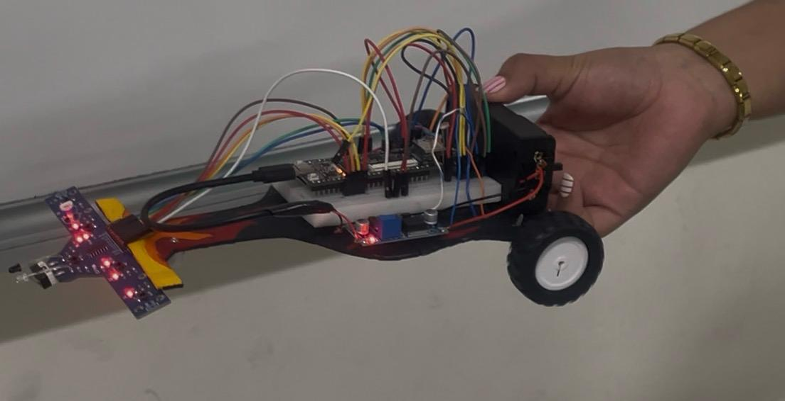

# Controlador Digital de Seguidor de Línea Competitivo en FPGA Tang Nano 9K

Este repositorio contiene la implementación completa de la **Etapa 3** del controlador digital de seguidor de línea desarrollado para la **"2ª Carrera de Carritos Seguidores de Línea 2026"** de la **Universidad Veracruzana**.

El diseño está implementado en hardware digital paralelo sobre una FPGA **Gowin GW1NR-LV9QN88PC6/I5** (placa de desarrollo Tang Nano 9K), lo que garantiza latencias de respuesta del orden de los nanosegundos para un seguimiento preciso a altas velocidades.

---

##  Características Competitivas del Diseño

1.  **Arranque Autónomo por Luz (LDR):** Cumple con la regla oficial del arranque autónomo. Cuenta con un módulo digital con filtro antirrebote de 10 ms e histéresis temporal que evita arranques falsos ante flashes u oscilaciones de luz ambiental. Una vez detectada la señal de salida, la bandera de carrera se enclava de forma permanente.
2.  **Modulación PWM Dual (20.7 kHz):** Provee control continuo de velocidad de 8 bits para dos micromotores N20 a través de un puente H TB6612FNG, eliminando ruidos audibles en los bobinados y optimizando la entrega de torque.
3.  **Giro por Pivoteo Activo (Curvas Cerradas):** En curvas críticas, el sistema invierte físicamente el sentido de giro del motor interno (marcha atrás) y acelera el externo hacia adelante. Esto proporciona un torque diferencial máximo para virajes de emergencia sin pérdida de adherencia.
4.  **Algoritmo de Recuperación Inteligente:** Al perder el contraste de la pista (`00000`), el robot recuerda su última dirección conocida y gira sobre su propio eje en ese sentido para reincorporarse. Si tras 2 segundos no recupera la línea, se detiene automáticamente por seguridad.

---

## Estructura del Repositorio

*   **`src/`**: Archivos de código fuente y restricciones.
    *   `seguidor_linea.v`: Módulo top-level integrador.
    *   `filtro_arranque.v`: Lógica de debouncing y enclavamiento del sensor LDR.
    *   `seguidor_linea_core.v`: Núcleo de control de velocidad, dirección y algoritmos.
    *   `controlador_pwm.v`: Generador PWM de 20.7 kHz para motores.
    *   `seguidor_linea.cst`: Restricciones de pines físicos (corregido a 1.8V para el Banco 3).
    *   `seguidor_linea.sdc`: Restricciones de frecuencia de reloj de 27 MHz (0 Warnings).
*   **`tb/`**: Suite de simulación.
    *   `seguidor_linea_tb.v`: Banco de pruebas completo para verificar transiciones de sensores, arranque, PWM y recuperación en simuladores HDL.
*   **`doc/`**: Documentación de ingeniería.
    *   `GUIA_GOWIN_EDA.md`: Manual paso a paso para compilar, asignar pines y programar la FPGA.
    *   `REPORTE_UNIVERSITARIO.md`: Informe académico formal detallando el diseño, diagrama de cableado, plan de pruebas y conclusiones técnicas.
*   **`fpga_project_seguidor/impl/pnr/fpga_project_seguidor.fs`**: Archivo bitstream compilado final, listo para ser grabado directamente en la memoria Flash de la Tang Nano 9K utilizando Gowin Programmer.

---

##  Verificación de Requisitos (Comité Técnico)

*   **Línea de seguimiento:** Negra, de 2 cm sobre fondo blanco.
*   **Sensores utilizados:** Arreglo frontal de 5 sensores infrarrojos.
*   **Arranque autónomo:** Detección digital por LDR estable (DO a Pin 33).
*   **Dimensiones físicas máximas:** largo: $\le 24\text{ cm}$, ancho: $\le 20\text{ cm}$ (Dimensiones del prototipo: $18\text{ cm} \times 14\text{ cm}$).
*   **Alimentación:** Batería LiPo interna de 2 celdas (7.4V) debidamente aislada.
*   **Peso aproximado del prototipo:** En proceso de pesaje y calibración (estimado < 250g para maximizar aceleración).

---

##  Instrucciones de Ejecución

Para grabar el controlador en tu hardware:
1. Abre **Gowin Programmer**.
2. Conecta la **Tang Nano 9K** mediante USB.
3. Carga el archivo precompilado ubicado en: `/fpga_project_seguidor/impl/pnr/fpga_project_seguidor.fs`.
4. Elige **Access Mode: Embedded Flash Mode** y presiona **Play**.

Pruebas:

## Participación en Eventos

### Expo Inovatek 2026

El proyecto **Seguidor de Línea con FPGA** fue presentado en la **Expo Inovatek 2026**, realizada el **4 de junio de 2026** en el **Gimnasio de la Universidad Veracruzana (UV)**.

Durante la exposición se mostró el funcionamiento del vehículo autónomo, destacando la implementación de una FPGA como unidad principal de control, la integración de sensores TCRT5000 para el seguimiento de línea y el sistema de control de motores para la navegación autónoma.

### Resultado Obtenido

 🏅 **Cuarto Lugar** en la Expo Inovatek 2026.

Este resultado reconoce el trabajo realizado en el diseño, construcción y programación del sistema, así como la aplicación de tecnologías de hardware programable en proyectos de robótica móvil.

### Evidencias

#### Presentación del proyecto

#### Demostración del funcionamiento

Video de la demostración:
https://drive.google.com/file/d/1cjfaxPKcUf6BWnYPSk9UGNIVukGlOuq9/view?usp=sharing

#### Equipo participante

### Impacto del Proyecto

La participación en la Expo Inovatek 2026 permitió compartir conocimientos sobre el uso de FPGA en sistemas embebidos, fomentar el interés por la robótica y recibir retroalimentación de docentes, estudiantes y asistentes al evento.

---
*Desarrollado para la carrera de alcance de seguidores de línea - Facultad de Ingeniería UV, 2026.*
